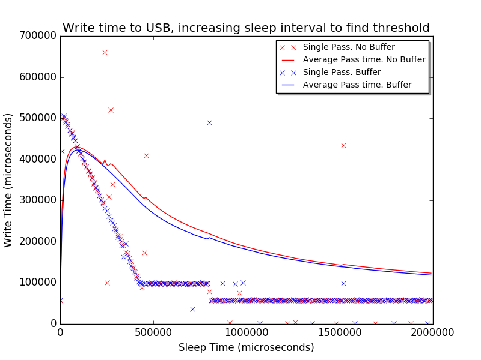
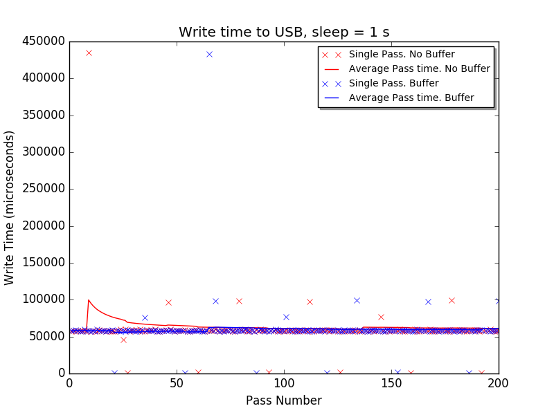
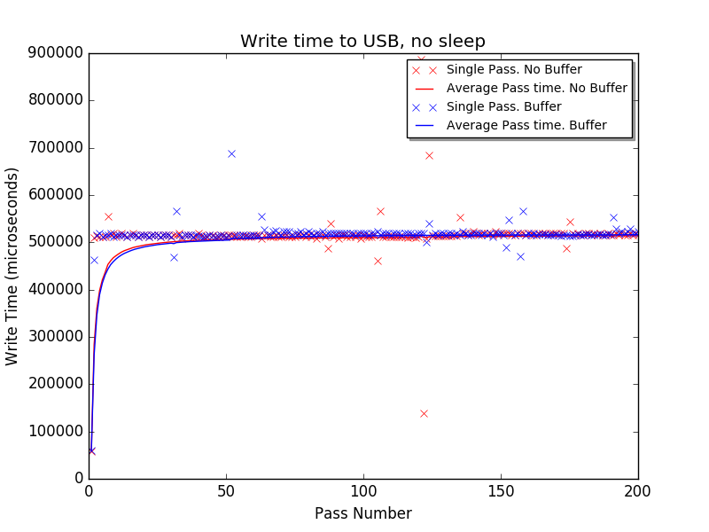
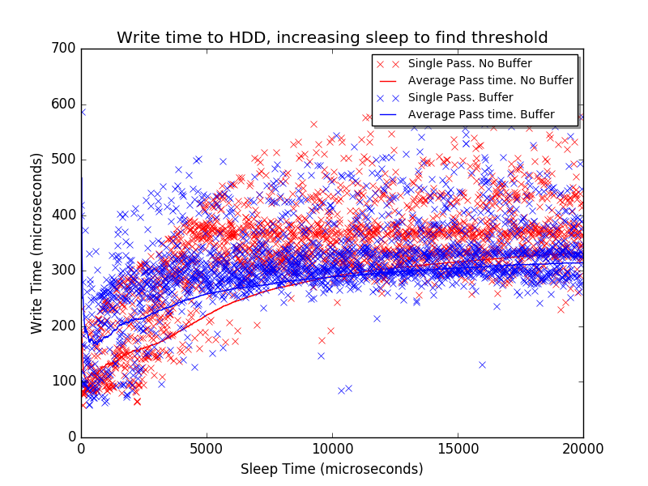
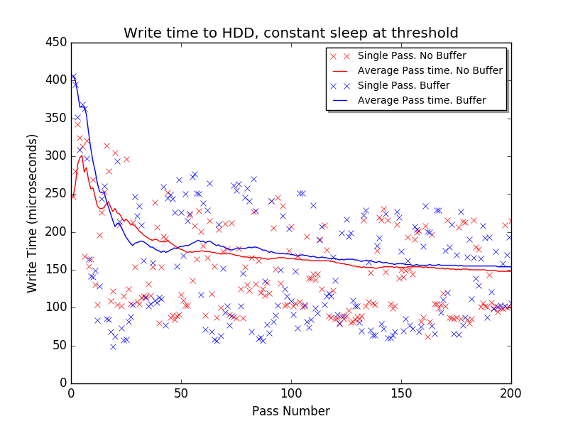
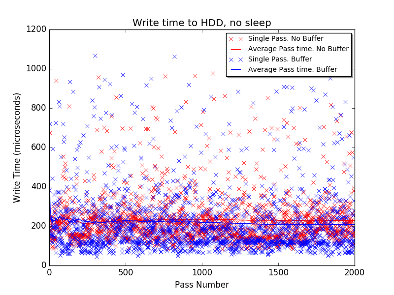

# Disk Performance Grapher

## Usage
1. `make`
2. Modify paramaters / uncomment tests in `diskGrapher.py`
3. `python diskGrapher.py`

## Requirements
- `$ sudo apt-get install python-matplotlib`

## Results

- Buffered perfomance increase: 4,785 μs
- Average buffered write: 118,972 μs
- Sleep time was increased by 10,000 μs each pass, for 200 passes

- Buffered perfomance increase: -116 μs
- Average buffered write: 61,201 μs
- Sleep time: 1 s

- Buffered perfomance increase: -1,974 μs
- Average buffered write: 516,220 μs
- Sleep time = 0 μs;

- Buffered perfomance increase: 17 μs
- Average buffered write: 315 μs
- Sleep time was increased by 10 μs each pass
- Passes: 2000

- Buffered perfomance increase: -6 μs
- Average buffered write: 154 μs
- Sleep time = 500 μs;
- Passes: 200

- Buffered perfomance increase: 20 μs
- Average buffered write: 209 μs
- Sleep time = 0 μs;
- Passes: 2000
